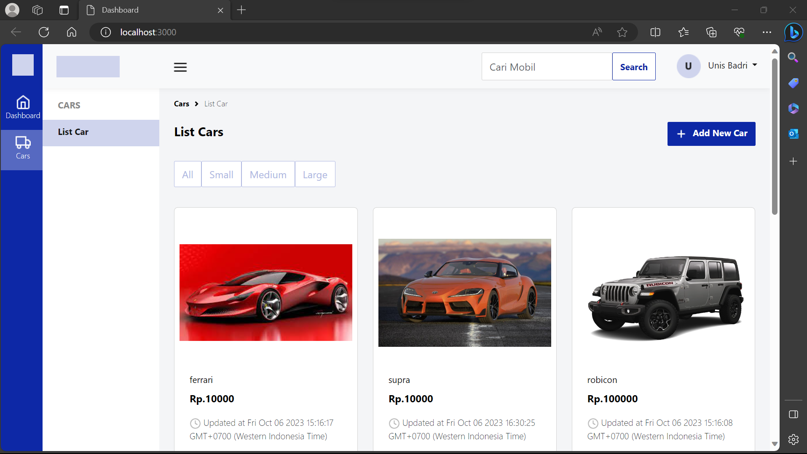
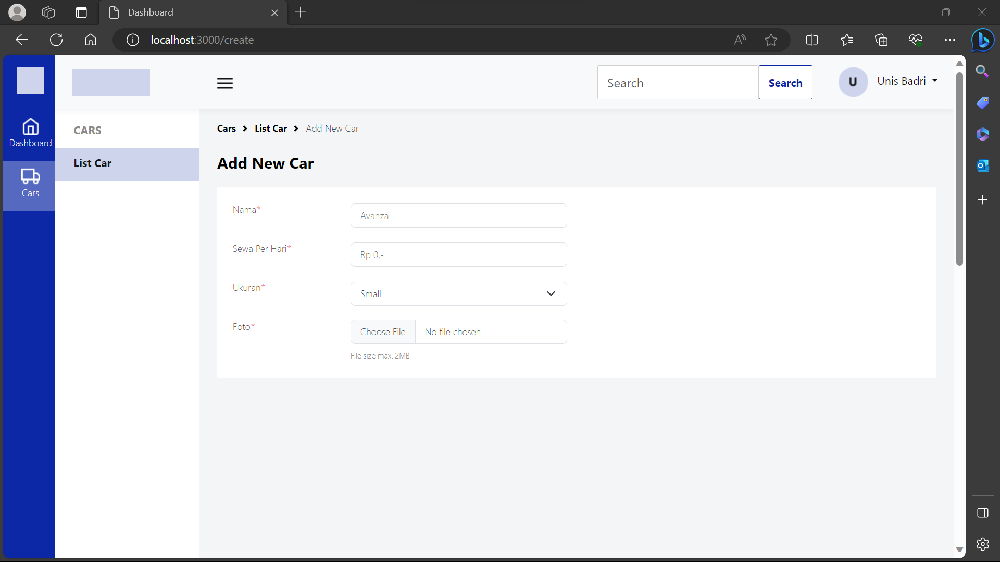
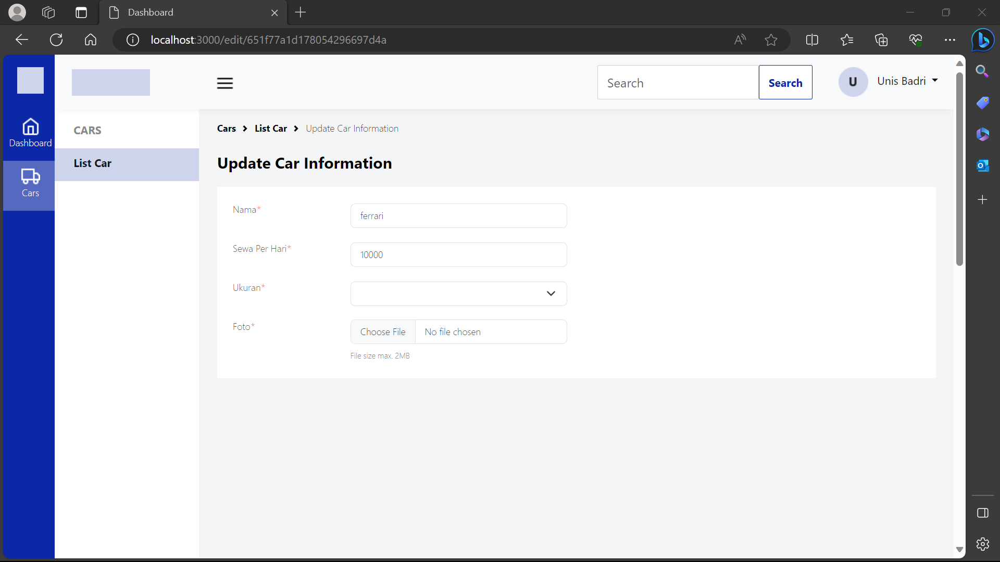
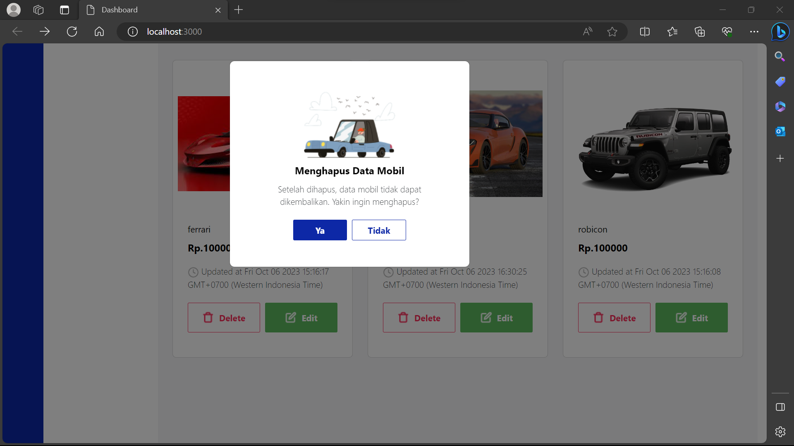
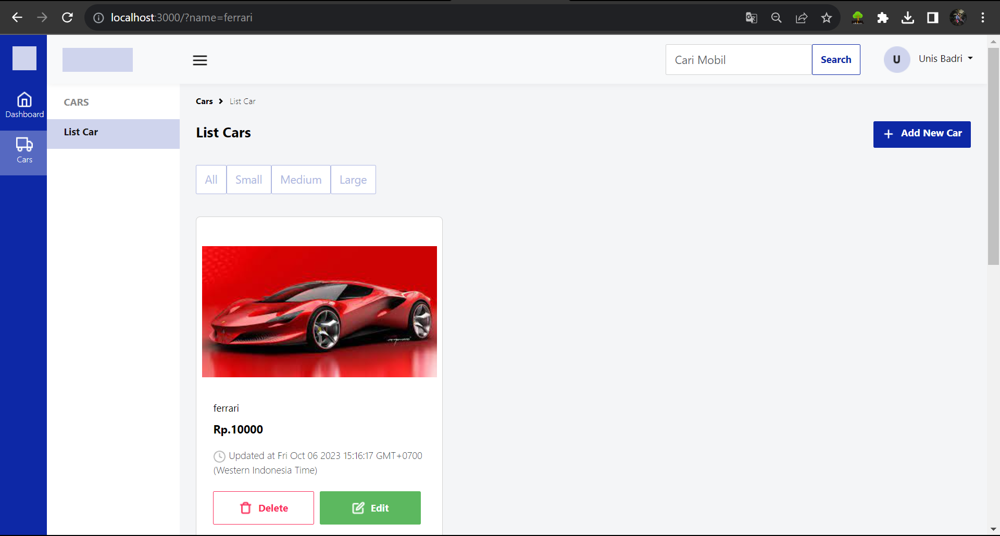
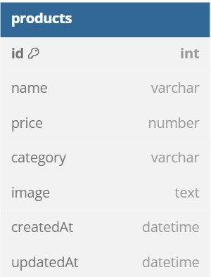

# Intallasi

sebelum memulai program pastikan anda menginstall mongodb, node.js dan npm di laptop anda.

# Clone Repository

https://github.com/fajri900/Challange-04-FSW-Template-Engine.git

# Install Express js

- npm intall express,
- npm init (untuk membuat dependencies isi dengan kebutuhan),

# Install module yang dibutuhkan

- npm i body-parser
- npm i connect-flash
- npm i dotenv
- npm i ejs express-session
- npm i flash
- npm i mongoose
- npm i morgan
- npm i multer

# Untuk menjalankan server anda perlu menjalankan dengan

- npm run dev

# Contoh beberapa halaman :

# Dashboard

# Add Card

# Update/Edit

# Delete

# Filter

# Diagram

